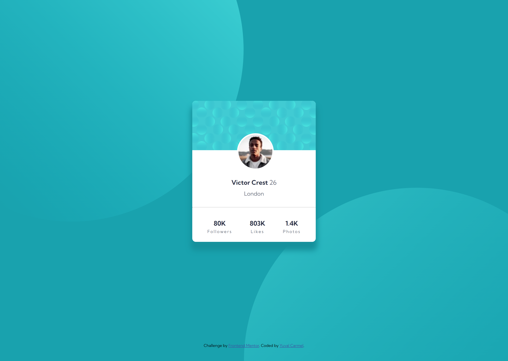

# Frontend Mentor - Profile card component solution

This is a solution to the [Profile card component challenge on Frontend Mentor](https://www.frontendmentor.io/challenges/profile-card-component-cfArpWshJ). Frontend Mentor challenges help you improve your coding skills by building realistic projects. 

## Table of contents

- [Overview](#overview)
  - [The challenge](#the-challenge)
  - [Screenshot](#screenshot)
  - [Links](#links)
- [My process](#my-process)
  - [Built with](#built-with)
  - [What I learned](#what-i-learned)
  - [Continued development](#continued-development)
  - [Useful resources](#useful-resources)

**Note: Delete this note and update the table of contents based on what sections you keep.**

## Overview

### The challenge

- Build out the project to the designs provided

### Screenshot




### Links

- Solution URL: [Add solution URL here](https://your-solution-url.com)
- Live Site URL: [Add live site URL here](https://your-live-site-url.com)

## My process

### Built with

- HTML
- CSS custom properties
- Flexbox

### What I learned

A bit of playing aroung with the background images.

To see how you can add code snippets, see below:

```css
.body {
  background-repeat: no-repeat, no-repeat;
  background-blend-mode: screen;
  background-position: right 52vw bottom 35vh, left 48vw top 52vh;
}
```

### Continued development

Need to continue learning how to align items within parent item. Background items alignment still requires improvements.

### Useful resources

The usual suspects. W3SCHOOLS and Google.